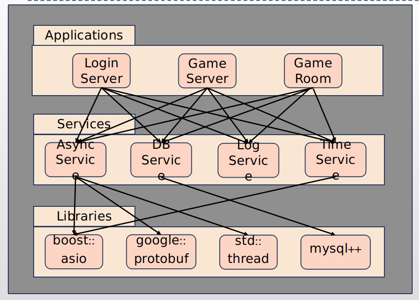

> 山川牌是一款轻量级卡牌类桌游，适合3名玩家，玩法简单，方便玩家快速上手，同时也可以体验与各路玩家博弈的快感，旨在为玩家提供有趣而刺激的休闲体验。每个玩家有在自己回合内可以选择合成或将手中卡牌交给下家，先凑出指定牌型者获得本轮游戏的胜利。

> 基础卡共36张，分别有水、火、光三种各12张，可转移或合成二阶卡。二阶卡共18张，分别又木、雾、烛三种各6张，可转移、使用或合成三阶卡。水+光=木，木牌：将此牌对你下家使用，接下来的一回合他将无法转移卡牌；水+火=雾，雾牌：将此牌对你下家使用，接下来的一回合他将无法合成卡牌；光+火=烛，烛牌：将此牌对你下家使用，你可查看他的手牌。木+雾+烛=巫，巫牌：此张卡牌可视作任意一张卡牌，且结算时可兑换分。扫码可查看H5介绍。

<!--more-->


## 一、总体设计

服务器的总架构分成三层如下图所示：



从图上我们看到服务器的整体架构分为三层：Libraries, Services和Applications。Services层基于Libraries实现，而Applications使用Services层提供的服务，并且要监听Services层的异步事件(Socket等)。

Services主要由4个Service组成，它们建立在Libraries的基础之上。给应用层提供了网络，数据库、时间和日志功能。AsyncService是整个系统的核心，为应用层提供异步网络通信的接口。

## 二、Libraries层

Libraries主要由四个库组成：`boost::asio`, `google::protobuf`, `mysql++`, `thread`。

`boost::asio`是一个异步IO库，提供了一个通用的异步框架，并提供了基本的`socket`的异步接口，它的主要功能是响应程序的异步IO请求，在操作完成以后，将其加入到一个完成队列之中, 在这个完成队列上有一些工作线程在等着，这些工作线程从完成队列上取出已经完成的操作，调用上层应用提供的一个回调函数–completaion handler。asio库是通过Proactor模式来完成这些工作的，在Windows是直接基于I/O completion port，而在类Unix系统中，是基于epoll等函数使用Reactor模式来模拟的。`boost::asio`是整个服务器架构的核心，此服务器采用的是异步架构。对`boost::asio`的详细介绍可以看我的[这篇博客](https://www.jianshu.com/p/6a4bf9fbfdaa)。

protocol buffers 是一种语言无关、平台无关、可扩展的序列化结构数据的方法，它可用于（数据）通信协议、数据存储等。`google::protobuf`在效率、兼容性等方面非常出色。而且对于`google::protobuf`的使用十分便捷，在此项目中，作用是序列化服务器和客户端协议。

`mysql++`是对mysql C API的延伸和扩展，用C++的语法风格实现数据库功能。

`thread`使用的是`std::thread`，相比`boost::thread`而言更稳定，而且我也更加熟悉，最重要的是`std::thread`与`boost::asio`并不会产生冲突。

## 三、Services层

### 1、AsyncService

AsyncService主要由两个类实现——`AsyncServer`和`AsyncSession`。其中`AsyncServer`类主要用于应答来自客户端的连接请求，接受连接时会为每一个客户端生成一个对应的`AsyncSession`对象，并将对象存储在`AsyncServer`的对应容器中。`AsyncServer`是一个模板类，因此声明和实现均放在同一个.h文件中。`AsyncServer`具有接受连接请求，保存并建立对应客户端消息处理类，建立心跳。如果服务器长时间没有收到来自客户端的心跳，将会主动断开连接。

```C++
template<typename Session>
class AsyncServer {
public:
    AsyncServer(boost::asio::io_context & io_context, short port, bool isbeats);

protected:
    tcp::acceptor acceptor_;
    std::vector<std::shared_ptr<Session>> client_info;
    bool is_heartbeats;
    bool is_threaded;

    void do_accept();

    virtual void accept_handler(tcp::socket socket) = 0;

    void HeartBeats_t();
};
```

从上述`AsyncServer`的声明可以知道`accept_handler`是个纯虚函数，派生类必须有对应的实现。其作用就是在建立连接后做一些处理，保存数据，开始`AsyncSession`的监听工作。

`AsyncSession`类是用来处理服务器和客户端之间的消息的：

```C++
class AsyncSession : public std::enable_shared_from_this<AsyncSession> {
public:
    explicit AsyncSession(tcp::socket socket);
    void StartSession();
    void SendMessages(const std::string & buffer);
    void SendHeartBeats();
    void RecvHeartBeats();
    ......
protected:
    void do_read();
    bool error_code_handler(const boost::system::error_code & ec);
    virtual void center_handler(std::string buffer) = 0;
    virtual void quit_handler() = 0;
    ......
    tcp::socket socket_;
    ......
};
```

从上述代码可以看出`center_handler()`和`quit_handler()`均为纯虚函数。也需要在其派生类中有对应的实现。两个回调函数分别用来处理消息和退出请求。

### 2、DBService

`DBService`主要用来处理数据库事宜，封装了`mysql++`，提供数据库的基本操作。主要管理数据库连接，执行查询操作，执行存储过程等。不同于`AsyncService`，`DBService`并没有采取异步操作。

### 3、LogService

`LogService`给服务器提供日志服务，能够志记服务器产生的详细信息，通过线程安全的单例模式确保不会产生多份日志文件或者在多线程高并发情况下日志记录混乱的情况。

### 4、TimeService

`TimeService`提供时钟服务，主要服务内容为返回规定格式的时间信息，timer功能并没有自己实现，而是使用的`boost::asio`库中自带的timer功能。

##　四、Application层

### 1、LoginServer及LoginSession

`LoginServer`继承自`AsyncServer`，并没有增加新功能，而且取消了心跳功能，在登录过程中不发送心跳，登录完成便断开连接，将剩下的内容交给`GameServer`。在`LoginServer`中主要就是用户登录注册、游客登录注册功能。成功登录后返回用户ID，这里留有接口，可以修改`GameServer`分配规则。

### 2、GameServer及GameSession

`GameServer`也是继承自`AsyncServer`，但是新增加了很多功能——游戏房间容器，匹配检测线程，匹配玩家容器，掉线玩家容器。当玩家进入匹配状态后，会将玩家信息加入到匹配容器中，匹配检测线程会一直检测该容器，当有符合对应匹配规则的三个玩家出现时，便将三个玩家的信息集中，并生成对应的游戏房间，再将房间初始化完成后加入游戏房间容器。当有玩家掉线时，则会将对应玩家的ID，所在游戏房间的房间号等信息存在掉线玩家容器中，若该房间的游戏还未结束且该玩家重连时，就会重新加入到该游戏房间，实现断线重连。

### 3、GameRoom

`GameRoom`主要实现的功能是初始化房间，洗牌，记录玩家的操作队列，完成重连，自动跳过。服务器选择的是帧同步，GameRoom只会存储游戏的初始状态以及所有的操作队列，重连过程需要用户客户端获取初始状态后再次重演操作。用户掉线后，服务器会自动跳过该用户的回合。

*********************************************

github: <https://github.com/toMyLord/The-Mountains>
